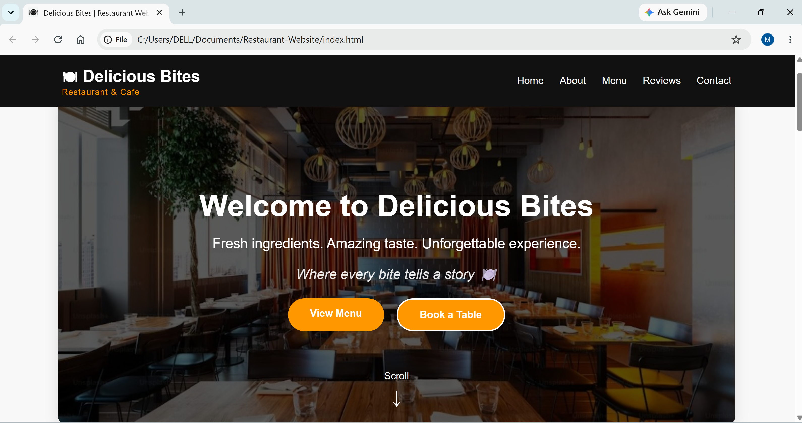
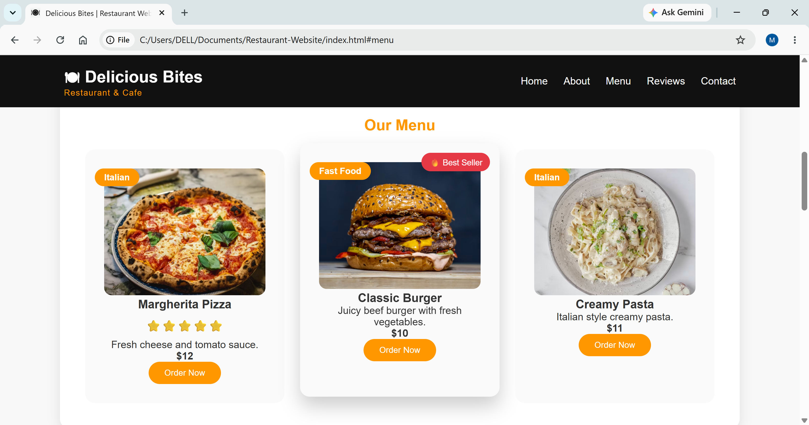
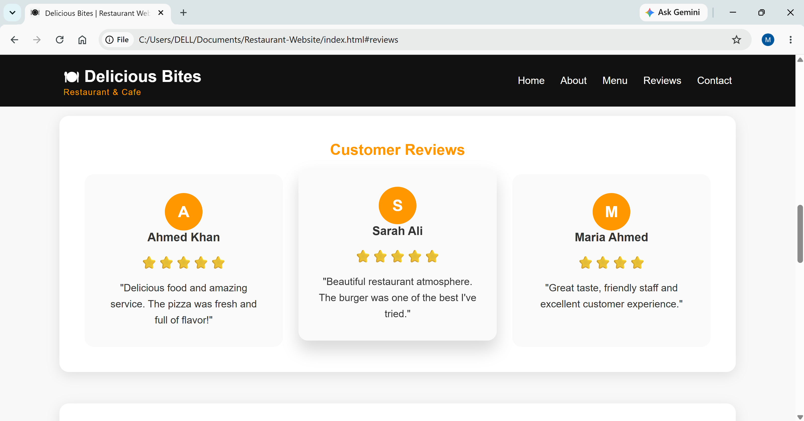

# Restaurant-Website
# 🍽️ Delicious Bites Restaurant Website

A modern, responsive restaurant website built to showcase a premium dining experience.  
This project focuses on clean UI design, responsive layouts, and interactive sections suitable for a real restaurant business.

## 🌐 Live Demo

https://mehreensultana01.github.io/Restaurant-Website/

## 📸 Screenshots






---

# ✨ Features

## 🏠 Hero Section
- Full-screen restaurant banner
- Attractive headline and tagline
- Call-to-action buttons:
  - View Menu
  - Book a Table

## 🍕 Food Menu
- Food cards with images
- Categories
- Dish descriptions
- Prices
- Order buttons
- Hover animations

## ⭐ Customer Reviews
- Customer feedback cards
- Star ratings
- Profile circles
- Responsive layout

## 📸 Food Gallery
- Restaurant and food images
- Modern grid layout
- Image hover effects

## 📩 Contact Section
- Contact form design
- Customer inquiry section
- Responsive form layout

## 📱 Responsive Design
- Desktop friendly
- Tablet optimized
- Mobile responsive navigation

---

# 🛠️ Technologies Used

- HTML5
- CSS3
- JavaScript
- Flexbox
- CSS Grid
- Responsive Design

---

# 📂 Project Structure

```
Restaurant-Website/

│── index.html
│── style.css
│── script.js
│── README.md
│
└── images/
    ├── pizza.jpg
    ├── burger.jpg
    ├── pasta.jpg
    └── restaurant.jpg
```

---

# 🎨 Design Highlights

- Modern restaurant branding
- Warm food-inspired color palette
- Smooth hover animations
- Clean user interface
- Business-focused layout

---

# 🚀 How To Run Locally

1. Clone the repository:

```bash
git clone https://github.com/yourusername/restaurant-website.git
```

2. Open the project folder.

3. Open:

```
index.html
```

in your browser.

---

# 📚 What I Learned

Through this project I practiced:

- Building responsive websites from scratch
- Creating reusable UI components
- Working with CSS layouts
- Improving user experience with animations
- Designing business websites

---

# 👩‍💻 Author

**Mehreen Sultana**

Front-End Developer

Skills:
- HTML
- CSS
- JavaScript
- WordPress
- Website Designing

---

⭐ If you like this project, consider giving it a star!
